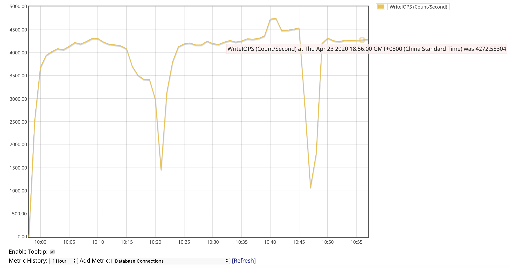
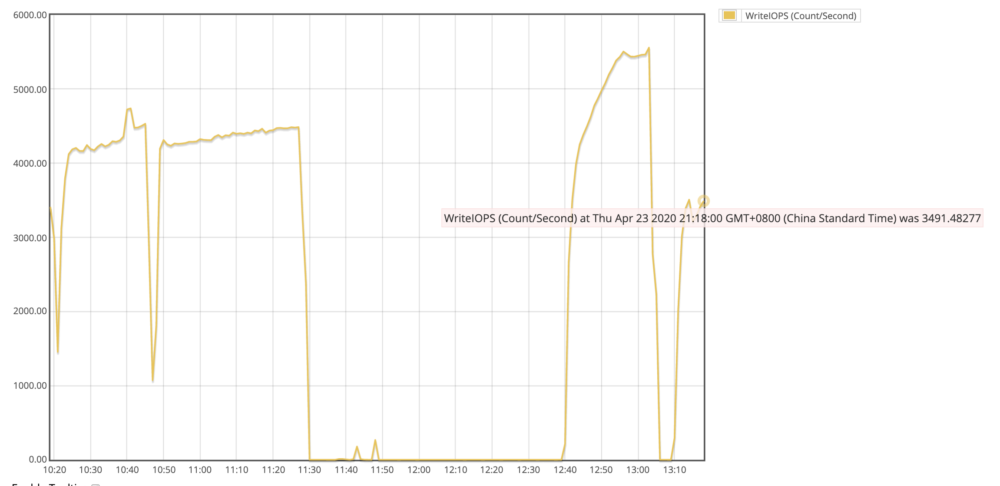

# 一、 新增OLTP按比例读写功能

### oltp-rw-withProportion
参数：

r_times 读操作比重，默认值1。
	
w_times 写操作比重，默认值1。


举例：

```
sysbench --mysql-host=[host name] --mysql-user=[user id] --mysql-password=[password] --mysql-db=[database] --table_size=1000000 --threads=36 --time=30000 --report-interval=1 --r_times=2 --w_times=3 oltp-rw-withProportion run
```


# 二、 SYSBENCH 下 IOPS的极限探索

## 目标

通过修改RDS实例类型、参数、多可用区部署等配置，探查sysbench iops压不上去的原因，发掘sysbench在benchmark过程中的局限性。

## 结论

Sysbench 自身的读写有局限性，而且数据结构简单、测试场景单调；同时受sysbench client 环境的影响，多线程并发太高时，性能存在性能损耗，影响测试结果的正确性。
建议在stage环境中，用真实的workload模拟压力测试。


## 测试过程

### 环境准备

rds：

[aaa-mysql.clahnijqri5x.ap-northeast-1.rds.amazonaws.com](http://aaa-mysql.clahnijqri5x.ap-northeast-1.rds.amazonaws.com)

  

db.r5.24xlarge

single az

no backup

no enhance monitoring

no Encryption

io1 2000 GiB 20000iops

client：

10* c5.9x(36)

same az（1c at tokyo）

* * *

sysbench --mysql-host=[aaa-mysql.clahnijqri5x.ap-northeast-1.rds.amazonaws.com](http://aaa-mysql.clahnijqri5x.ap-northeast-1.rds.amazonaws.com)--mysql-user=admin --mysql-password=1qaz2WSX --mysql-db=test1 --table_size=1000000 --threads=36 --time=30000 --report-interval=1 oltp_insert run

  

同时运行10台client

  

  

  

  

  

  

### 修改参数：

  

同时运行10台client 

  

  

  

  

### 阶段小结：

有提升，但是不明显。

  

  

sysbench --mysql-host=[aaa-mysql.clahnijqri5x.ap-northeast-1.rds.amazonaws.com](http://aaa-mysql.clahnijqri5x.ap-northeast-1.rds.amazonaws.com)--mysql-user=admin --mysql-password=1qaz2WSX --mysql-db=test1 --table_size=1000000 --threads=108 --time=30000 --report-interval=1 oltp_insert run

  

  

  

tps没有增加反而降低了，延迟大大增加了。

  

  

  

### 阶段小结：

增加线程数并不能增加tps，应该增加机器（vcpu）。

  

  

sudo sh -c 'for x in /sys/class/net/eth0/queues/rx-*; do echo f,ffffffff > $x/rps_cpus; done'

sudo sh -c "echo 32768 > /proc/sys/net/core/rps\_sock\_flow_entries"

sudo sh -c "echo 4096 > /sys/class/net/eth0/queues/rx-0/rps\_flow\_cnt"

sudo sh -c "echo 4096 > /sys/class/net/eth0/queues/rx-1/rps\_flow\_cnt"

  

### 以上重启后还原

  

sudo sh -c "echo 'kernel.pid_max = 65535' >> /etc/sysctl.conf"

sudo sh -c "echo '* soft nofile 65536' > /etc/security/limits.d/20-nproc.conf"

sudo sh -c "echo '* hard nofile 65536' >> /etc/security/limits.d/20-nproc.conf"

  

sudo reboot

  

sysbench --mysql-host=[aaa-mysql.clahnijqri5x.ap-northeast-1.rds.amazonaws.com](http://aaa-mysql.clahnijqri5x.ap-northeast-1.rds.amazonaws.com)  --mysql-user=admin --mysql-password=1qaz2WSX --mysql-db=test1 --table\_size=1000000 --threads=36 --time=30000 --report-interval=1 oltp\_insert run

  

  

  

通之前的36 threads 比，没有什么大的变化。

  

sysbench --mysql-host=[aaa-mysql.clahnijqri5x.ap-northeast-1.rds.amazonaws.com](http://aaa-mysql.clahnijqri5x.ap-northeast-1.rds.amazonaws.com)  --mysql-user=admin --mysql-password=1qaz2WSX --mysql-db=test1 --table\_size=1000000 --threads=36 --time=30000 --report-interval=1 oltp\_insert run

  

  

IOPS倒是高了一点

  

sysbench --mysql-host=[aaa-mysql.clahnijqri5x.ap-northeast-1.rds.amazonaws.com](http://aaa-mysql.clahnijqri5x.ap-northeast-1.rds.amazonaws.com)  --mysql-user=admin --mysql-password=1qaz2WSX --mysql-db=test1 --table\_size=1000000 —threads=154 --time=30000 --report-interval=1 oltp\_insert run

  

### 运行3台 改成 multi az

  

  

  

  

刚打开 multi az的时候：

  

  

运行一段时间后

  

  

  

### 阶段小结：

multi-az 对性能影响有限。

  

找到一个case：[https://paragon-na.amazon.com/hz/view-case?caseId=6164945421](https://paragon-na.amazon.com/hz/view-case?caseId=6164945421)

说明5.7.22 iops有瓶颈。。。。。。

  

### 升级到目前最新的5.7.28（和火币dba用的一样）

sysbench --mysql-host=[aaa-mysql.clahnijqri5x.ap-northeast-1.rds.amazonaws.com](http://aaa-mysql.clahnijqri5x.ap-northeast-1.rds.amazonaws.com)  --mysql-user=admin --mysql-password=1qaz2WSX --mysql-db=test1 --table\_size=1000000 --threads=36 --time=30000 --report-interval=1 oltp\_insert run

  

### 运行10台client

  

  

和之前5.7.22比tps和95%没有大的变化

  

  

iops 倒是明显的高了，但是还没有到1w。

当前数据表达到4亿行，truncate table后再跑一次。

  

  

  

明显tps更高一点、95%更低一点。

  

write io 更少了。似乎5.7.28 的io利用率更高，并且在数量大时，有更高的io极限。

  

sysbench --mysql-host=[aaa-mysql.clahnijqri5x.ap-northeast-1.rds.amazonaws.com](http://aaa-mysql.clahnijqri5x.ap-northeast-1.rds.amazonaws.com)  --mysql-user=admin --mysql-password=1qaz2WSX --mysql-db=test1 --table_size=1000000 --threads=36 --time=30000 --report-interval=1 oltp\_read\_write run

  

  

  

  

混合读写之后iops更高了一点。。。什么原理？读似乎都被cache了。

  

干掉缓存

  

重新运行10client(中间停掉一台)

  

  

  

io增长速度：30/分钟

  

增加数据和表看一下：

  

sysbench --mysql-host=[aaa-mysql.clahnijqri5x.ap-northeast-1.rds.amazonaws.com](http://aaa-mysql.clahnijqri5x.ap-northeast-1.rds.amazonaws.com)  --mysql-user=admin --mysql-password=1qaz2WSX --mysql-db=test3 --table\_size=100000000  --threads=36 --time=30000 --report-interval=10 --tables=30 oltp\_read_write prepare

  

  

  

如果固定了机型、数据量、sysbench测试方法（读写模式）现在看响应时间包括：client 线程等待+client到mysql网络延迟和数据传输+mysql处理并发+db引擎解析sql等操作+磁盘io+mysql到client网络延迟和数据传输

大概这5部分，与之相关的“常量”如下：

  

client 线程等待 ----> client

client到mysql网络延迟和数据传输------> 网络延迟

mysql到client网络延迟和数据传输------> 网络延迟

db引擎解析sql等操作------>引擎

磁盘io------>磁盘配置

mysql处理并发------>实例配置

  

  

唯一的变量：改变线程大小，因为从目前测试看所有的case都远没有达到磁盘吞吐、网络带宽上限，和这个变量相关的“响应时间组成部分”：

  

client 线程等待 ----> client

db引擎解析sql等操作------>引擎

mysql处理并发------>实例配置

  

因为前面说过，固定了机型，剩下可以优化的只有：

  

client 线程等待 ----> client

db引擎解析sql等操作------>引擎

  


  

可以看到5的位置，做数据的时候增大了io，超过了1w。

等待11个小时后看：


  


  

  

### 结论：
Sysbench 自身的读写有局限性，而且数据结构简单、测试场景单调；同时受sysbench client 环境的影响，多线程并发太高时，性能存在性能损耗，影响测试结果的正确性。
建议在stage环境中，用真实的workload模拟压力测试。

